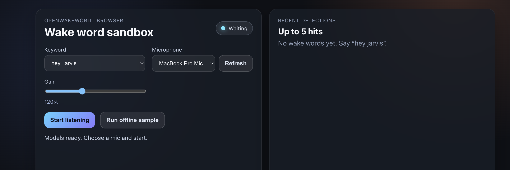

# OpenWakeWord WASM React demo

Playground for the `openwakeword-wasm-browser` engine. 



## Prerequisites

- Node.js 18+
- Chrome/Edge with microphone access (AudioWorklet + SharedArrayBuffer enabled)
- ONNX assets present in `public/openwakeword/models` (already committed here; re-copy if you update the models)

## Install everything

From the monorepo root:

```bash
# install / build the library dependency
npm install

# install demo deps
cd openwakeword_wasm_react_demo
npm install
```

If you ever clean `public/`, re-copy the models and sample WAV:

```bash
cp -R ../models ./public/openwakeword/models
cp ../hey_jarvis_11-2.wav ./public/openwakeword/hey_jarvis_11-2.wav
```

## Run the demo (recommended workflow)

`npm start` sometimes fails for this AudioWorklet-heavy project, so use the production build served via `serve`:

```bash
cd openwakeword_wasm_react_demo
npm run build
npx serve -s build   # or `serve -s build` if you have serve installed globally
```

Then open the printed URL (typically [http://localhost:3000](http://localhost:3000)). The widget loads the keyword models from `/openwakeword/models`, prompts for a microphone, and streams detections.

1. Select a keyword and microphone.
2. Click **Start listening** and grant mic permissions.
3. Talk near the mic—VAD status updates in the header, detections appear on the right.
4. Use **Run offline sample** to sanity-check the pipeline with the bundled `hey_jarvis_11-2.wav`.

## Notes & customization

- `WakeWordEngine` is imported from the local package (`file:../openwakeword_wasm`). After changing the library, re-run `npm install` inside the demo so it pulls the fresh tarball.
- Assets are loaded relative to `/openwakeword/…`. Make sure `public/openwakeword` ships with your host (or update `baseAssetUrl`).
- Flip `debug: true` in `src/WakeWordWidget.js` to log chunk RMS, VAD confidences, and per-keyword scores for easier debugging.
